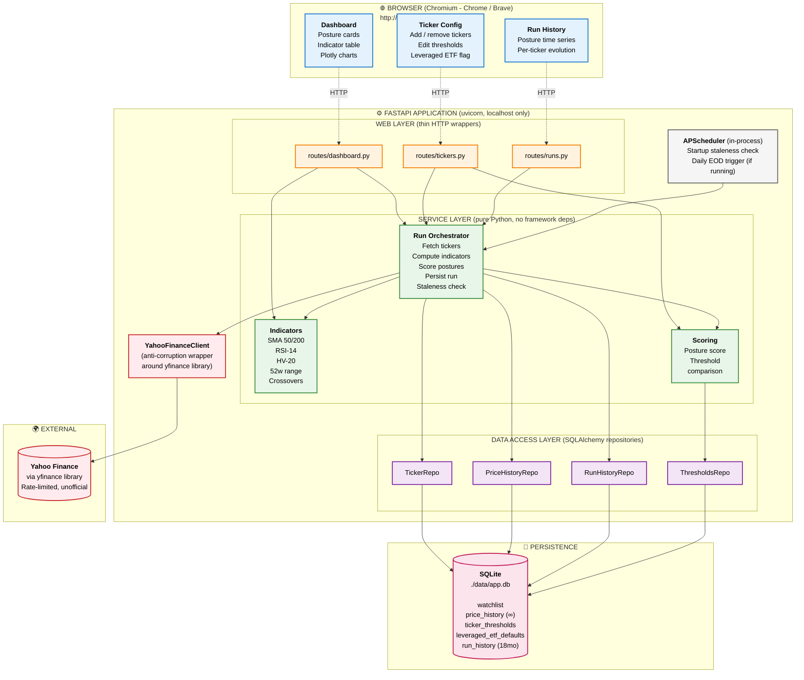

# Architecture Design Document

**Project:** Technical Analysis Signal Scanner
**Version:** Local v1 (with planned AWS future-state)
**Date:** April 19, 2026
**Status:** Approved for implementation

---

## 1. Purpose and Scope

This application is a personal-use technical analysis (TA) signal scanner that assists a casual long-hold retail investor in making portfolio allocation posture decisions (deploy aggressively, ease in, hold, ease out, liquidate) across a small watchlist of tickers. It is explicitly **not** a trading system, not a backtesting engine, and not a real-time tool.

### In Scope (v1)
- Daily close-based technical analysis for 6-20 tickers
- Computation of trend, momentum, range, and volatility indicators
- Posture scoring per ticker based on configurable thresholds
- Web UI accessible via Chromium browsers (Chrome, Brave)
- Local-only deployment (single machine, single user)
- Historical posture tracking for self-review (18 months)
- Per-ticker threshold overrides (e.g., leveraged ETFs like TQQQ)
- Editable watchlist and thresholds via UI

### Out of Scope (v1)
- Intraday data or real-time streaming
- Automated trading or order execution
- Authentication / authorization / multi-user (deferred to AWS future-state)
- Market-wide aggregate signals (e.g., overall cash deployment signals)
- Backtesting or strategy simulation
- Mobile-native UI (Chromium desktop only)
- Exports or screenshot features (native screenshot tools suffice)

---

## 2. Architectural Style

The application follows a **3-tier client-server architecture** (presentation / application / data) with a **hexagonal-lite** pattern applied within the application tier. The Yahoo Finance integration is isolated as an **anti-corruption layer** to insulate the domain from the instability of the unofficial `yfinance` library.

### Why this style
- **3-tier** matches the deployment reality: a browser, a server process, and a persistent store. It is the lowest-friction starting point for a local web app with a clear path to cloud.
- **Hexagonal-lite** means the core business logic (indicators, scoring, orchestration) has no dependencies on the web framework or the database. This is the key discipline that makes the AWS migration (Section 9) cheap rather than painful.
- **Anti-corruption layer** for Yahoo Finance means when the `yfinance` library breaks due to upstream HTML changes (which happens periodically), the fix is localized to one adapter class.

---

## 3. Technology Stack

| Layer | Technology | Rationale |
|---|---|---|
| Language | Python 3.12 | Stable, well-supported by scientific libs and all AWS runtimes |
| Web framework | FastAPI | Modern, async-native, auto-generates API docs, standard for Python web |
| Templating | Jinja2 | Server-side HTML rendering, no build step |
| Frontend interactivity | Vanilla JavaScript | App complexity does not justify a framework |
| Styling | Tailwind CSS (CDN) | No build step, strong defaults, good "at-a-glance" polish |
| Charting | Plotly.js (CDN) | Interactive zoom/pan/hover for price + SMA overlays |
| Database | SQLite | File-based, zero-admin, sufficient for local scale |
| ORM | SQLAlchemy | Abstracts SQLite (local) and Postgres (future RDS) |
| Market data | yfinance | Only practical free option for Yahoo Finance data |
| Scheduling | APScheduler | In-process, no external infrastructure |
| ASGI server | uvicorn | Standard runner for FastAPI |
| Browser target | Chromium (Chrome, Brave) | Per requirements |

**Deliberately excluded:** Node.js (no build tooling), React (not warranted by complexity), Docker locally (deferred to AWS deployment).

---

## 4. Architecture Diagram

The standalone diagram source is maintained in `architecture-diagram.mmd`.

---

## 5. Layer Descriptions

### 5.1 Presentation Tier (Browser)

Chromium-only, served from `http://127.0.0.1:8000`. Three logical pages:

- **Dashboard** — the primary view. Posture cards per ticker, tabular indicator detail, interactive Plotly charts with price and SMA overlays.
- **Ticker Config** — watchlist management. Add/remove tickers, edit per-ticker thresholds, view/override leveraged ETF defaults.
- **Run History** — posture evolution over time. Answers "has this ticker's posture been stable or has it flipped?"

All pages are server-rendered via Jinja2 templates. Interactivity is implemented in vanilla JavaScript (expected ~100-200 lines total). Plotly.js and Tailwind CSS are loaded from CDN — no local build step, no Node.js dependency.

### 5.2 Application Tier (FastAPI)

Runs as a single `uvicorn` process bound to `127.0.0.1` (loopback only — not reachable from the network).

**Web Layer** is intentionally thin. Each route does three things: parse the HTTP request, invoke a service-layer function, serialize the response. This is the layer that will be replaced (or re-wrapped) when moving to AWS Lambda.

**Service Layer** contains all business logic as pure Python, with no FastAPI or SQLAlchemy imports inside it. Three components:

- **Indicators** — computes SMA-50, SMA-200, RSI-14, HV-20 (20-day annualized historical volatility), 52-week high/low, and crossover state. Input: pandas DataFrame of OHLC. Output: a structured indicator object.
- **Scoring** — takes indicator values and per-ticker thresholds, returns a posture score (-5 to +5) and label. Pure function, no side effects.
- **Run Orchestrator** — coordinates a full run: iterate the watchlist, fetch fresh data via the Yahoo adapter, compute indicators, apply scoring, persist results. Also handles the startup staleness check that auto-runs if the last run is stale.

**Data Access Layer** uses the SQLAlchemy ORM with the repository pattern. Each repository exposes domain-friendly methods (e.g., `get_watchlist()`, `save_run(run)`) rather than raw SQL. This layer is where the SQLite-to-RDS swap happens in the AWS future-state without disturbing the service layer.

**Yahoo Finance Adapter** wraps the `yfinance` library behind a clean interface: `fetch_history(ticker, days) -> DataFrame`. Isolates the external dependency so that (a) `yfinance` breakages are contained to one file, and (b) tests can mock the adapter without hitting the real Yahoo.

**APScheduler** is an in-process scheduler handling two jobs: a startup staleness check (auto-run if data is stale) and a daily end-of-day trigger (fires only if the app is running at the scheduled time). This entire component is removed in the AWS future-state, replaced by EventBridge.

### 5.3 Data Tier (SQLite)

Single file at `./data/app.db`. Schema overview:

| Table | Purpose | Retention |
|---|---|---|
| `watchlist` | User's tracked tickers (includes nullable `created_by_user_id` for future RBAC) | Forever (user-managed) |
| `price_history` | Daily OHLC bars per ticker | Forever (needed for 200-SMA) |
| `ticker_thresholds` | Per-ticker posture scoring threshold overrides | Forever (user-managed) |
| `leveraged_etf_defaults` | Curated list of leveraged ETFs with recommended thresholds | Forever (seed data) |
| `run_history` | Posture snapshots over time | **18 months (nightly prune)** |

The retention split (forever for `price_history`, 18 months for `run_history`) is deliberate: daily OHLC is cheap and always needed for indicator calculation, while posture history is primarily for user self-review and loses relevance after roughly a year.

---

## 6. Indicator Specifications

| Indicator | Period | Formula / Source | Purpose |
|---|---|---|---|
| Latest Close | — | Most recent daily close | Baseline |
| SMA-50 | 50 days | Simple mean of last 50 closes | Intermediate trend |
| SMA-200 | 200 days | Simple mean of last 200 closes | Long-term trend |
| Price vs SMA-50 (%) | — | (Close − SMA50) / SMA50 × 100 | Short-term stretch |
| Price vs SMA-200 (%) | — | (Close − SMA200) / SMA200 × 100 | Long-term stretch (key signal) |
| Crossover State | — | Compare SMA-50 to SMA-200 | Regime marker (golden/death cross) |
| RSI-14 | 14 days | Wilder's RSI on daily closes | Momentum / overbought-oversold |
| HV-20 (annualized) | 20 days | stdev(daily log returns) × √252 | Volatility for deployment sizing |
| HV-20 percentile | 252 days | Rank of current HV-20 in trailing year | Relative volatility regime |
| 52-week high | 252 days | Max close over trailing 252 days | Range ceiling |
| 52-week low | 252 days | Min close over trailing 252 days | Range floor |
| % from 52w high | — | (Close − High52) / High52 × 100 | How stretched toward ceiling |
| % from 52w low | — | (Close − Low52) / Low52 × 100 | How stretched from floor |

**Nine primary values per ticker, readable at a glance.** HV-20 is surfaced as both raw % and trailing-year percentile because the percentile is what drives the deploy-all-at-once vs ease-in decision; the raw value gives context.

---

## 7. Posture Scoring Rules (Starter Set)

Each ticker receives a **Posture Score** in the range [-5, +5], computed by summing signal contributions:

| Signal | +1 (bullish for deploying cash) | -1 (bearish for deploying cash) |
|---|---|---|
| Price vs SMA-200 | Below to -5% below | More than +15% above |
| Price vs SMA-50 | Below | More than +10% above |
| Crossover state | Golden cross (SMA50 > SMA200) | Death cross (SMA50 < SMA200) |
| RSI-14 | Below 35 (oversold) | Above 70 (overbought) |
| 52-week range position | Bottom 25% | Top 10% |

**Posture mapping:**

| Score | Posture |
|---|---|
| +3 to +5 | Deploy aggressively |
| +1 to +2 | Ease in |
| 0 | Hold / no signal |
| -1 to -2 | Ease out |
| -3 to -5 | Liquidate / trim aggressively |

**HV-20 is intentionally excluded from the score.** Volatility is an orthogonal signal that modifies *how* to act on the posture (lump sum vs average in), not *what* the posture is.

**Thresholds are stored in the database, not in code.** All five thresholds above are per-ticker configurable via the UI. Global defaults apply unless a per-ticker override exists.

**Leveraged ETFs ship with different default thresholds** (e.g., TQQQ: -20% and +30% for the SMA-200 signal). A curated list of common leveraged ETFs lives in `leveraged_etf_defaults`; on ticker add, if the ticker matches, the leveraged thresholds pre-populate `ticker_thresholds`.

---

## 8. Key Design Decisions and Trade-offs

| Decision | Chosen | Rejected Alternative | Rationale |
|---|---|---|---|
| Web framework | FastAPI | Flask | Async-native, modern, auto-docs, better AWS-future alignment |
| Frontend | Jinja2 + vanilla JS | React (no-build via CDN) | Complexity not warranted; simpler to maintain |
| Database | SQLite | Flat files (CSV/JSON) | SQL queries, transactional integrity, clean RDS migration path |
| Scheduling | APScheduler (in-process) | OS cron, Celery | Self-contained; no extra installs; cleanly excisable for AWS |
| Yahoo integration | yfinance + adapter wrapper | Direct HTTP to Yahoo endpoints | Community-maintained, handles endpoint churn |
| Local auth | None | Password-gated | 127.0.0.1 binding means no threat model exists; auth would be theater |
| AWS deployment path | FastAPI + Mangum (v1 port) | Separated Lambda handlers | Faster port; clean layer separation delivers 90% of the benefit |
| Retention: price_history | Forever | Rolling window | Storage cost is trivial; needed for 200-SMA; enables future backtesting |
| Retention: run_history | 18 months | Forever | User-facing self-review data loses relevance; keeps database compact |
| Local failure mode | Show stale data with badge | Fail/block on fetch error | Graceful degradation; one ticker's failure doesn't block others |
| Volatility in posture score | Excluded | Included as 6th signal | Orthogonal signal; informs *how* to act, not *what* to do |

---

## 9. Future-State: AWS Deployment

The architecture is designed for a low-friction migration to AWS for personal + family use (max ~5 users, hand-provisioned accounts, no self-registration).

### Mapping

| Local Component | AWS Equivalent |
|---|---|
| Browser → `127.0.0.1:8000` | Browser → CloudFront → API Gateway |
| FastAPI + uvicorn | FastAPI + Mangum adapter running in Lambda |
| APScheduler | EventBridge scheduled rules triggering Lambda |
| SQLite | RDS Postgres (small instance) |
| Local file system | — (stateless Lambda; all state in RDS) |
| No auth | AWS Cognito (hand-provisioned users, role claims for RBAC) |
| Local secrets (none) | AWS Secrets Manager |

### What changes in the code
- SQLAlchemy connection string swaps from `sqlite:///` to `postgresql://`. Query code unchanged.
- FastAPI app wrapped in Mangum for Lambda execution.
- APScheduler code deleted; EventBridge rule calls a Lambda handler that invokes the run orchestrator.
- New auth dependency injected into routes, reading Cognito JWT claims.
- RBAC enforcement added to routes that mutate shared configuration (e.g., leveraged ETF defaults).

### What does not change
- Service Layer (indicators, scoring, orchestrator) — zero changes.
- Yahoo Finance adapter — zero changes.
- Jinja2 templates and vanilla JS — minimal changes (auth-aware UI elements only).
- Database schema — only the dialect, not the structure.

### Estimated migration effort
Roughly one focused weekend of work, assuming AWS account setup and IAM foundations are in place. The discipline applied at v1 (hexagonal-lite separation, repository pattern, adapter pattern) is what makes this true.

---

## 10. Non-Functional Characteristics

| Attribute | Target | Notes |
|---|---|---|
| Availability | Best-effort local | App runs when laptop is on and app is started |
| Performance | < 10s for a full 20-ticker run | yfinance sequential fetch; async parallelization available if needed |
| Data freshness | Daily close | Fetched post-market close; staleness badge if older than expected |
| Recoverability | Trivial | SQLite file is the entire state; backup = file copy |
| Portability | Python 3.12 + pip install | No OS-specific dependencies |
| Security (local) | N/A by design | Localhost-only binding; no network exposure |
| Security (AWS) | Cognito auth, HTTPS, Secrets Manager | Deferred to AWS phase |
| Observability | Structured logs to stdout | Sufficient for local; CloudWatch in AWS phase |

---

## 11. Open Questions / Deferred Decisions

- **RBAC model specifics** — deferred until AWS phase. Nullable `created_by_user_id` column is included in schema from v1 to avoid migration friction later.
- **Per-ticker threshold override UX** — basic form in v1; richer comparison UI (show default vs override side by side) may be added later.
- **Backtesting engine** — explicitly out of scope for v1. The `price_history` retention policy preserves the option.
- **Market-wide aggregate signals** — out of scope for v1. If added, will require a new "portfolio" or "market" view distinct from per-ticker views.

---

## 12. Glossary

| Term | Definition |
|---|---|
| SMA | Simple Moving Average |
| RSI | Relative Strength Index |
| HV | Historical Volatility (annualized standard deviation of daily returns) |
| OHLC | Open, High, Low, Close (daily bar data) |
| Golden Cross | SMA-50 crosses above SMA-200 (bullish regime marker) |
| Death Cross | SMA-50 crosses below SMA-200 (bearish regime marker) |
| Posture | Allocation stance: Deploy Aggressively / Ease In / Hold / Ease Out / Liquidate |
| Anti-Corruption Layer | Adapter pattern isolating an external dependency from the domain |
| Hexagonal-Lite | Ports-and-adapters discipline applied pragmatically, not dogmatically |

---

*This document is the source of truth for architectural decisions on this project. When future conversations need context, load this file.*
